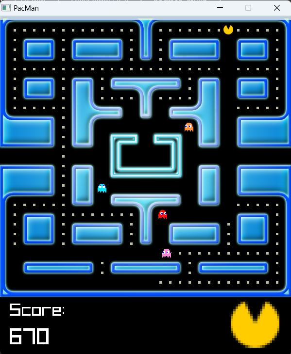

# Pacman raylib

Pacman raylib is a small pacman clone written in C using the graphics library [raylib](https://www.raylib.com/). I originally wrote this as a university project, then later came back and cleaned up the code a bit. If I were to rewrite this in the future, I would do a few things differently, but back in university I was proud of how well this turned out.

## Instructions to run (on Windows)

 - Install raylib: last time I set this project up, I used this [install method](https://www.raylib.com/) for its flexibility
 - Clone this repo
 - Run ```make``` in the directory
 - Launch ```pacman_raylib.exe```
 - Enjoy!

## Screenshots



